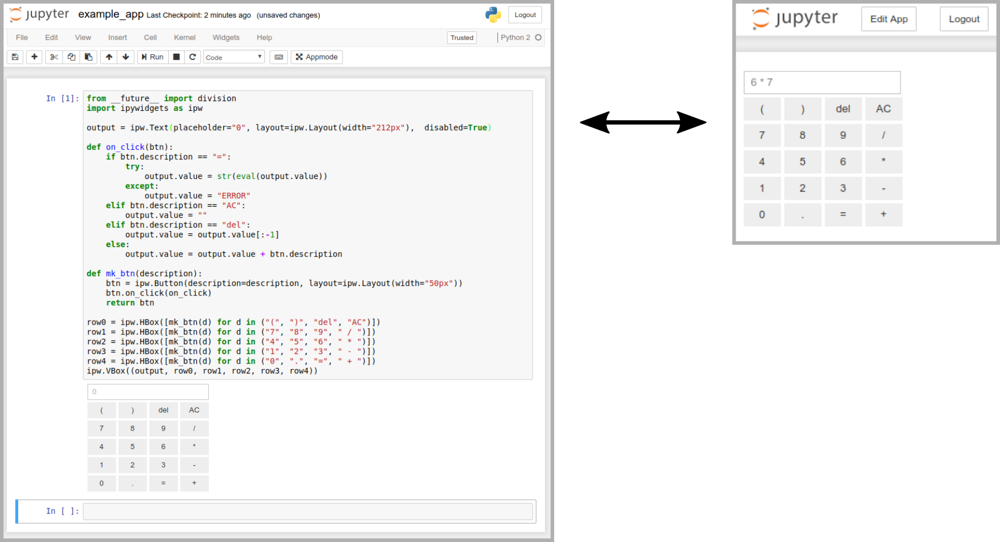

# Appmode

**A Jupyter extensions that turns notebooks into web applications.**



## Try it live

[](https://mybinder.org/v2/gh/oschuett/appmode/master?urlpath=%2Fapps%2Fexample_app.ipynb)

Click the binder badge to try it live without installing anything. This will take you directly to the "app" version of the notebook.


## Installation

If you use `conda`, you can install it as:
```
conda install --channel conda-forge appmode
```

If you use ``pip``, you can install it as:
```
pip install appmode
jupyter nbextension     enable --py --sys-prefix appmode
jupyter serverextension enable --py --sys-prefix appmode
```

If you want to use [mybinder](https://mybinder.org) add the following `environment.yml` file to your repository:
```
channels:
  - conda-forge
dependencies:
  - appmode
```

## Description

Appmode consist of a server-side and a notebook extension for Jupyter. Together these two extensions provide the following features:

- One can view any notebook in appmode by clicking on the *Appmode* button in the toolbar. Alternatively one can change the url from ``baseurl/notebooks/foo.ipynb`` to ``baseurl/apps/foo.ipynb``. This also allows for direct links into appmode.

- When a notebook is opened in appmode, all code cells are automatically executed. In order to present a clean UI, all code cells are hidden and the markdown cells are read-only.

- A notebook can be opened multiple times in appmode without interference. This is achieved by creating temporary copies of the notebook for each active appmode view. Each appmode view has its dedicated ipython kernel. When an appmode page is closed the kernel is shutdown and the temporary copy gets removed.

- To allow for passing information between notebooks via url parameters, the current url is injected into the variable ``jupyter_notebook_url``.

## Server Side Configuration

Appmode adds the following [configuration options](https://jupyter-notebook.readthedocs.io/en/stable/config.html):
- `Appmode.trusted_path` Run only notebooks below this path in Appmode. Default: No restrictions.
- `Appmode.show_edit_button` Show _Edit App_ button during Appmode. Default: True.
- `Appmode.show_other_buttons` Show other buttons, e.g. Logout, during Appmode. Default: True.

## Client Side Customization

The UI elements of Appmode can be customized via the [custom.js](http://jupyter-notebook.readthedocs.io/en/stable/examples/Notebook/JavaScript%20Notebook%20Extensions.html#custom.js) file. Some examples are:
```
$('#appmode-leave').hide();                          // Hides the edit app button.
$('#appmode-busy').hide();                           // Hides the kernel busy indicator.
$('#appmode-loader').append('<h2>Loading...</h2>');  // Adds a loading message.
```
Beware that hiding the edit button does not prevent users from leaving Appmode by changing the URL manually.

## Development

With the included [Dockerfile](./Dockerfile) a development environment can be quickly created:

1. Install [Docker](https://docs.docker.com/engine/installation/).
2. git clone this repository
3. `docker build --tag appmode_dev ./`
4. `docker run --init -ti -p8888:8888 appmode_dev`
5. Browse to `http://localhost:8888/apps/example_app.ipynb`
